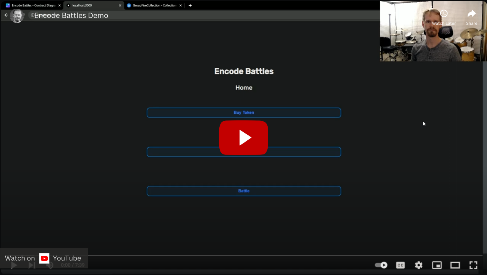
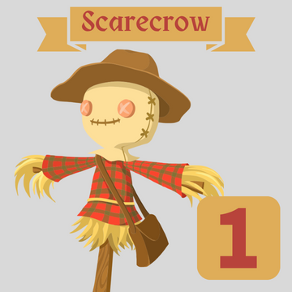
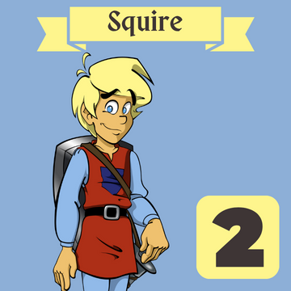
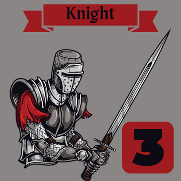
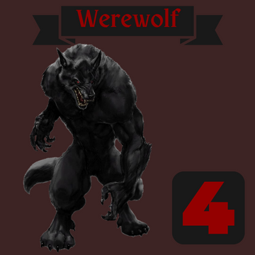
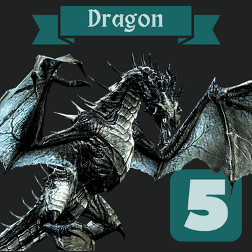

# Encode Club Solidity Bootcamp - 2pm Cohort - Group 5

## Final Project: Encode Battles

### Class Presentation

<a href="https://www.youtube.com/watch?v=5CVLDfDvQ0I&t=1935s">

</a>
<br>
Start at 32:15

### Tech Stack:

#### Backend

- Solidity
- Hardhat
- Ethers.js
- TypeScript
- Chainlink VRF
- IPFS
- Open Zeppelin
- Pinata SDK
- Alchemy SDK

#### Frontend

- Next.js
- TypeScript
- Web3UIKit
- Alchemy SDK
- Wagmi Hooks
- Viem
- RainbowKit

### Description

#### Purchase ERC20 & ERC721

Users interact with the TokenSale contract to:

- purchase our ERC20 token GFT with ETH
- use GFT to mint ERC721 tokens

[Contract Diagram Here](https://www.canva.com/design/DAFu1BL-Ifo/yfL_bk1-St-KVU8jynai1A/edit?utm_content=DAFu1BL-Ifo&utm_campaign=designshare&utm_medium=link2&utm_source=sharebutton)

#### Deployed Contracts

[ERC20 Contract](https://sepolia.etherscan.io/address/0xAa3ac6a564754Dd401c3c02117fb04F76073cf39)
<br>
[ERC721 Contract](https://sepolia.etherscan.io/address/0x598B3afe31CcA5aa00238A176f1C28Dc44ed3d87)
<br>
[TokenSale Contract](https://sepolia.etherscan.io/address/0x8Cb98E146133DA743E0BefA8F11Cf01015867bC4)
<br>
[EncodeBattles Contract](https://sepolia.etherscan.io/address/0x3446014D7ca1f1D937CFEdc8a4bE61f2fB44A7D4)
<br>

#### NFT Power Levels

There are 5 power levels of NFTs

- Chainlink VRF is used to generate a random number
- Each power level has a percent chance of being minted:
  - Power 5: 5%
  - Power 4: 10%
  - Power 3: 15%
  - Power 2: 20%
  - Power 1: 50%

#### NFT Images & Metadata

Each level of NFT has a corresponding image & metadata object

- NFT metadata is stored on IPFS
- Each level of NFT has an image included in its metadata
- These images are stored on IPFS and pinned by Pinata

<p align="left">





</p>
<br>

#### [View NFT Collection Here](https://testnets.opensea.io/collection/groupfivecollection-2)

#### The Game

<p>
Players asynchronously submit the power level of their NFT. Once two players have submitted power levels, the powers are compared and a winner is determined.
</p>

Contract reads/writes are done via Wagmi Hooks.

When users submit their NFT for battle:

- NFT ownership is confirmed using the alchemy SDK
- NFT metadata is fetched on the frontend using the alchemy SDK
- NFT power, NFT id, and player address are submited to the battle contract
- GFT is minted to both the winner and the loser in amounts that were passed to the game contract constructor at deployment
- The battle info is stored in an array within the contract

## How to use the project

### 1. Clone the repo

```bash
$ git clone https://github.com/Spencer-Sch/Encode_Solidity_Bootcamp_Group_5_Final_Project.git
```

### 2. Set-up .env

- Create a new `.env` in the root directory of both `backend` and `frontend`
- Follow steps listed in `.env.example` in both the `backend` and `frontend` directories to add necessary environment variables to your `.env`

### 3. Start up Next.js Frontend

- Navigate to ./project_files/frontend/
- Open a new terminal in the directory
- Run the following:

```bash
$ npm install
```

```bash
$ npm run dev
```

- Open [http://localhost:3000](http://localhost:3000) with your browser
